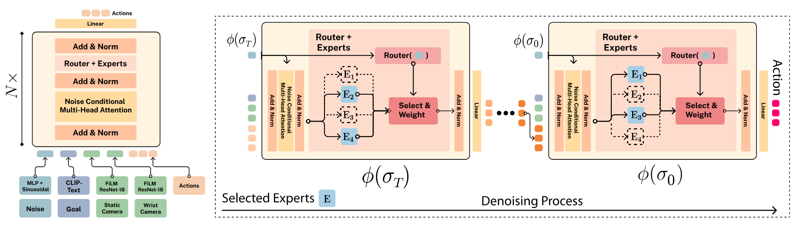
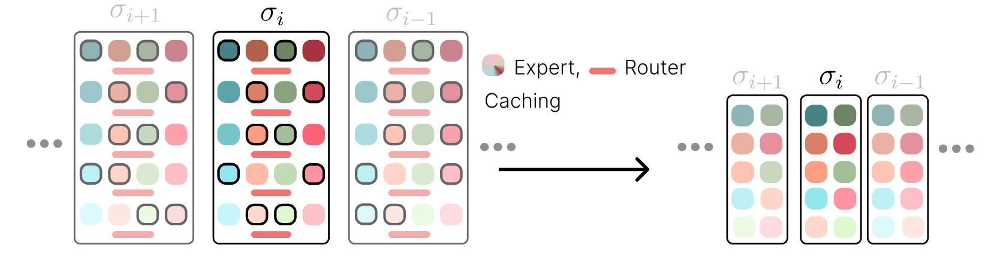
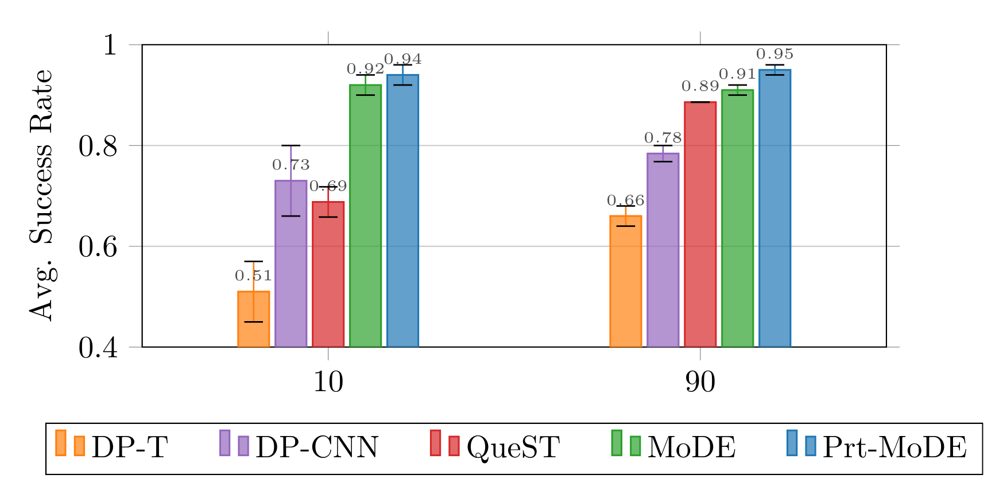
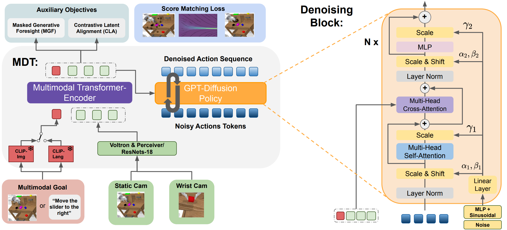
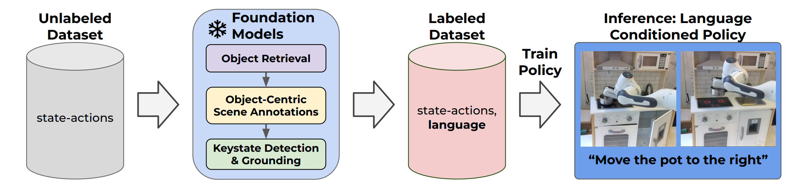
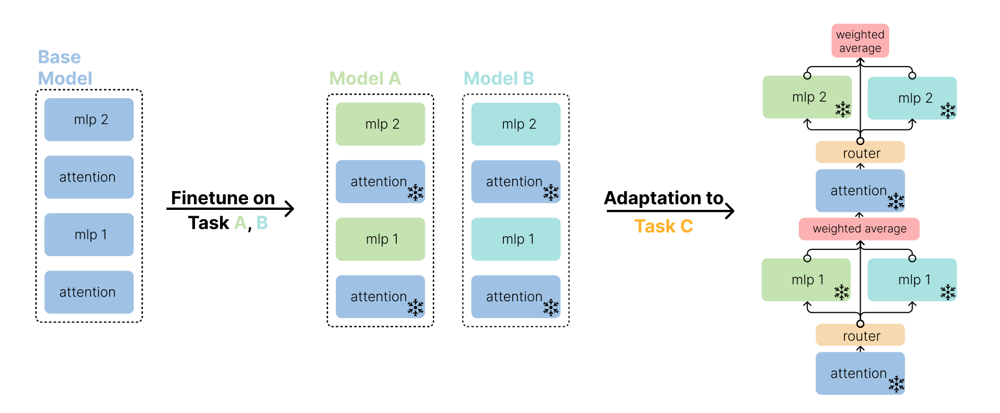

    

        <h2>Abstract</h2>
        

Diffusion Policies have become widely used in Imitation Learning, offering several appealing properties, such as generating multimodal and discontinuous behavior.
As models are becoming larger to capture more complex capabilities, their computational demands increase, as shown by recent scaling laws. 
Therefore, continuing with the current architectures will present a computational roadblock. 
To address this gap, we propose Mixture-of-Denoising Experts (MoDE) as a novel policy for Imitation Learning.
MoDE surpasses current state-of-the-art Transformer-based Diffusion Policies while enabling parameter-efficient scaling through sparse experts and noise-conditioned routing, reducing both active parameters by $40\%$ and inference costs by $90\%$ via expert caching.
Our architecture combines this efficient scaling with noise-conditioned self-attention mechanism, enabling more effective denoising across different noise levels. 
MoDE achieves state-of-the-art performance on 134 tasks in four established imitation learning benchmarks (CALVIN and LIBERO). 
Notably, by pretraining MoDE on diverse robotics data, we achieve 4.01 on CALVIN ABC and 0.95 on LIBERO-90. 
It surpasses both CNN-based and Transformer Diffusion Policies by an average of $57\%$ across 4 benchmarks, while using 90% fewer FLOPs and fewer active parameters compared to default Diffusion Transformer architectures. Furthermore, we conduct comprehensive ablations on MoDE's components, providing insights for designing efficient and scalable Transformer architectures for Diffusion Policies.
        

    

## Method Overview

    

MoDE uses a transformer with
causal masking from top to bottom. Each transformer block uses noise-conditional self-attention
and is followed by a noise-conditioned router, that distributes tokens to specialized expert models
conditioned on the current noise level. Each expert is a simple MLP with Swish-GLU activation.

---

### Mixture-of-Experts for Enhanced Efficiency in Diffusion Policies

The Mixture-of-Denoising Experts (MoDE) policy presents a groundbreaking approach for handling the high computational cost in imitation learning diffusion policies. Traditional diffusion models require vast computational resources, making them less feasible for real-time robotics. MoDE addresses this limitation by utilizing a sparse mixture-of-experts (MoE) model, where only a subset of experts is activated based on the noise level in each stage of the denoising process. This selective activation significantly reduces the model’s active parameters and floating-point operations (FLOPs), lowering inference costs by 40% compared to conventional transformer-based diffusion policies. This advance makes MoDE not only a powerful tool for complex imitation learning tasks but also a computationally efficient choice for real-world applications requiring high-speed decision-making, such as robotics​.

### Noise-Conditioned Routing and Self-Attention in Diffusion Transformers

MoDE introduces a novel noise-conditioned routing mechanism, paired with a noise-conditioned self-attention framework, optimizing how tokens are allocated to specialized experts during the denoising process. By conditioning both the routing and self-attention mechanisms on noise, the model dynamically adjusts token routing, enhancing denoising at each stage and achieving a refined action generation across a wide range of imitation learning tasks. This innovative strategy demonstrates a 20% improvement over previous diffusion models and reduces the risk of expert collapse by ensuring effective distribution of tokens across experts based on task demands.

    

A key advantage of our noise-conditioned design is the deterministic routing path at each noise level, which can be precomputed. By determining the chosen experts ahead of time, the selected expert MLPs can be fused into a single, composite MLP, effectively reducing computation costs. This fused MLP enables parallel execution, substantially decreasing network latency and streamlining memory access patterns by eliminating the need for dynamically invoking each expert. Our caching strategy further reduces FLOPs overhead by over 80% compared to standard MoE rollouts, making the model twice as fast during inference.

## MoDE Excels in Long-Horizon Multi-Task Learning on LIBERO Benchmark

MoDE achieves the highest average performance in both LIBERO-10 (Long) and LIBERO-90 benchmarks, while the QueST baseline is
the second best in the LIBERO-90 setting and the CNN-architecture is second best in the long horizon
setting. These results demonstrate MoDE’s ability to learn long-horizon tasks with high accuracy.
The performance gap is more pronounced in the challenging LIBERO-10 experiment, where MoDE
is the first policy to achieve an over 90% success rate. Furthermore, MoDE surpasses prior best
Diffusion baselines by an average of 16% in both settings, all while maintaining its computational
advantage. This showcases MoDE’s ability to achieve state-of-the-art performance with a more
efficient use of computational resources.

    

        
    

#### Example Rollouts

    

        

            
            
                <video autoplay muted loop playsinline>
                    <source src="{{ video.path | relative_url }}" type="video/mp4">
                    Your browser does not support the video tag.
                </video>
            
        

    

## State-of-the-Art Performance on CALVIN Benchmark

In our experiments on the demanding CALVIN Language-Skills Benchmark, MoDE consistently outperforms all baselines. For instance, in the ABCD→D evaluation, MoDE without pretraining achieves a 4.30 average sequence length out of 5 possible tasks, surpassing RoboFlamingo (4.09) and GR-1 (4.21), both of which utilize large-scale pretraining. With pretraining, MoDE reaches an even higher average length of 4.39, setting a new state-of-the-art result. Similarly, in the more challenging ABC→D zero-shot test, MoDE without pretraining achieves an average sequence length of 3.39, substantially improving upon Diff-P-CNN’s 1.35 and GR-1’s 3.06. With pretraining, MoDE achieves an average of 3.98 in the zero-shot scenario, outpacing other methods and demonstrating strong generalization capabilities.

#### Results on ABC→D

| Method        | Active Params (Million) | PrT    | 1      | 2      | 3      | 4      | 5      | Avg. Len.        |
|---------------|-------------------------|--------|--------|--------|--------|--------|--------|-----------------|
| Diff-P-CNN    | 321                     | ×      | 63.5%  | 35.3%  | 19.4%  | 10.7%  | 6.4%   | 1.35±0.05        |
| Diff-P-T      | 194                     | ×      | 62.2%  | 30.9%  | 13.2%  | 5.0%   | 1.6%   | 1.13±0.02        |
| RoboFlamingo  | 1000                    | ✓      | 82.4%  | 61.9%  | 46.6%  | 33.1%  | 23.5%  | 2.47±0.00        |
| SuSIE         | 860+                    | ✓      | 87.0%  | 69.0%  | 49.0%  | 38.0%  | 26.0%  | 2.69±0.00        |
| GR-1          | 130                     | ✓      | 85.4%  | 71.2%  | 59.6%  | 49.7%  | 40.1%  | 3.06±0.00        |
| **MoDE**      | 307                     | ×      | 91.5%  | 79.2%  | 67.3%  | 55.8%  | 45.3%  | 3.39±0.03        |
| **MoDE**      | 436                     | ✓      | **96.2%** | **88.9%** | **81.1%** | **71.8%** | **63.5%** | **4.01±0.04** |

#### Results on ABCD→D

| Method        | Active Params (Million) | PrT    | 1      | 2      | 3      | 4      | 5      | Avg. Len.        |
|---------------|-------------------------|--------|--------|--------|--------|--------|--------|-----------------|
| Diff-P-CNN    | 321                     | ×      | 86.3%  | 72.7%  | 60.1%  | 51.2%  | 41.7%  | 3.16±0.06        |
| Diff-P-T      | 194                     | ×      | 78.3%  | 53.9%  | 33.8%  | 20.4%  | 11.3%  | 1.98±0.09        |
| RoboFlamingo  | 1000                    | ✓      | 96.4%  | 89.6%  | 82.4%  | 74.0%  | 66.0%  | 4.09±0.00        |
| GR-1          | 130                     | ✓      | 94.9%  | 89.6%  | 84.4%  | 78.9%  | 73.1%  | 4.21±0.00        |
| **MoDE**      | 277                     | ×      | 96.6%  | 90.6%  | 86.6%  | 80.9%  | 75.5%  | 4.30±0.02        |
| **MoDE**      | 436                     | ✓      | **97.1%** | **92.5%** | **87.9%** | **83.5%** | **77.9%** | **4.39±0.04** |

#### Example Rollouts

    

        

            
            
                <video autoplay muted loop playsinline>
                    <source src="{{ video.path | relative_url }}" type="video/mp4">
                    Your browser does not support the video tag.
                </video>
            
        

    

## Evaluation on SIMPLER against Octo and OpenVLA

Compared to state-of-the-art models like Octo and OpenVLA on the SIMPLER benchmark, our approach achieves the highest average success rate (26.30%) and the best overall ranking (1.65) across diverse manipulation tasks. It excels at complex challenges, such as drawer manipulation (34.92% success) and precise object interactions (40% success on vertical can picking). While stacking tasks remain challenging, these results underscore its scalable, generalist capabilities and consistently strong performance across a broad range of scenarios.

| Metric                                       | OpenVLA Score | OpenVLA Rank | Octo Base Score | Octo Base Rank | MoDe (ours) Score | MoDe (ours) Rank |
|----------------------------------------------|---------------|--------------|----------------|----------------|-------------------|-----------------|
| **Average**                                   | **23.70%**    | 1.95         | 17.75%          | 2.1            | **26.30%**        | **1.65**         |

#### Example Rollouts

    

        

            
            
                <video width="224px" autoplay muted loop playsinline>
                    <source src="{{ video.path | relative_url }}" type="video/mp4">
                    Your browser does not support the video tag.
                </video>
            
            
            
                <video width="224px" autoplay muted loop playsinline>
                    <source src="{{ video.path | relative_url }}" type="video/mp4">
                    Your browser does not support the video tag.
                </video>
            
        

    

<!DOCTYPE html>

  <h2>Citation</h2>
  <pre class="bibtex-citation">@misc{reuss2024efficient,
    title={Efficient Diffusion Transformer Policies with Mixture of Expert Denoisers for Multitask Learning},
    author={Moritz Reuss and Jyothish Pari and Pulkit Agrawal and Rudolf Lioutikov},
    year={2024},
    eprint={2412.12953},
    archivePrefix={arXiv},
    primaryClass={cs.LG}
}</pre>
  <button class="copy-button" onclick="navigator.clipboard.writeText(document.querySelector('.bibtex-citation').innerText)">
    Copy BibTeX
  </button>
  

<!-- ## Acknowledgements

The work presented here was funded by the German Research Foundation (DFG) – 448648559. -->

## Related Projects
<h3><a href="https://intuitive-robots.github.io/mdt_policy/">Multimodal Diffusion Transformer: Learning Versatile Behavior from Multimodal Goals</a></h3>

    

        
    

    

        

        The Multimodal Diffusion Transformer (MDT) is a novel framework that learns versatile behaviors from multimodal goals with minimal language annotations. Leveraging a transformer backbone, MDT aligns image and language-based goal embeddings through two self-supervised objectives, enabling it to tackle long-horizon manipulation tasks. In benchmark tests like CALVIN and LIBERO, MDT outperforms prior methods by 15% while using fewer parameters. Its effectiveness is demonstrated in both simulated and real-world environments, highlighting its potential in settings with sparse language data.
        

    

<h3><a href="https://robottasklabeling.github.io/">Scaling Robot Policy Learning via Zero-Shot Labeling with Foundation Models</a></h3>

    

        
    

    

        

Using pre-trained vision-language models, NILS detects objects, identifies changes, segments tasks, and annotates behavior datasets. Evaluations on the BridgeV2 and kitchen play datasets demonstrate its effectiveness in annotating diverse, unstructured robot demonstrations while addressing the limitations of traditional human labeling methods.
        

    

<h3><a href="https://arxiv.org/pdf/2411.02207">Collective Model Intelligence Requires Compatible Specialization</a></h3>

    

        
    

    

        

This work highlights the limitations of current model merging methods, like feature averaging, due to representational divergence during fine-tuning, which reduces merging effectiveness. Using CKA, the authors show that as models specialize, their internal representations become increasingly incompatible. Routing-based strategies improve merging but remain limited by these incompatibilities.
        

    

