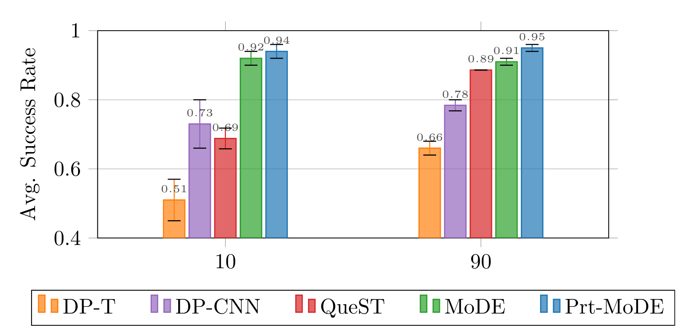

<div class="columns is-centered has-text-centered">
    <div class="column is-four-fifths">
        <h2>Abstract</h2>
        <div class="content has-text-justified">
Diffusion Policies have become widely used in Imitation Learning, offering several
appealing properties, such as generating multimodal and discontinuous behavior.
As models are becoming larger to capture more complex capabilities, their compu-
tational demands increase, as shown by recent scaling laws. Therefore, continuing
with the current architectures will present a computational roadblock. To address
this gap, we propose Mixture-of-Denoising Experts (MoDE) as a novel policy for
Imitation Learning. MoDE surpasses current state-of-the-art Transformer-based
Diffusion Policies while enabling parameter-efficient scaling, reducing the infer-
ence cost significantly. To achieve this, MoDE uses sparse experts combined with a
novel routing strategy that conditions the expert selection on the current noise level
of the denoising process. This is combined with a noise-conditioned self-attention
mechanism for further improvements. MoDE achieves state-of-the-art performance
across 134 tasks in four established imitation learning benchmarks (CALVIN and
LIBERO). It surpasses both CNN-based and Transformer Diffusion Policies by
an average of 20% in all settings, while using 40% fewer FLOPs and fewer ac-
tive parameters. Furthermore, we conduct comprehensive ablations on MoDE’s
components, providing insights for designing efficient and scalable Transformer
architectures for Diffusion Policies.
        </div>
    </div>
</div>

## Method Overview

<div class="columns is-centered">
    
</div>

MoDE uses a transformer with
causal masking from top to bottom. Each transformer block uses noise-conditional self-attention
and is followed by a noise-conditioned router, that distributes tokens to specialized expert models
conditioned on the current noise level. Each expert is a simple MLP with Swish-GLU activation.

---

### Mixture-of-Experts for Enhanced Efficiency in Diffusion Policies

The Mixture-of-Denoising Experts (MoDE) policy presents a groundbreaking approach for handling the high computational cost in imitation learning diffusion policies. Traditional diffusion models require vast computational resources, making them less feasible for real-time robotics. MoDE addresses this limitation by utilizing a sparse mixture-of-experts (MoE) model, where only a subset of experts is activated based on the noise level in each stage of the denoising process. This selective activation significantly reduces the model’s active parameters and floating-point operations (FLOPs), lowering inference costs by 40% compared to conventional transformer-based diffusion policies. This advance makes MoDE not only a powerful tool for complex imitation learning tasks but also a computationally efficient choice for real-world applications requiring high-speed decision-making, such as robotics​.

### Noise-Conditioned Routing and Self-Attention in Diffusion Transformers

MoDE introduces a novel noise-conditioned routing mechanism, paired with a noise-conditioned self-attention framework, optimizing how tokens are allocated to specialized experts during the denoising process. This design leverages the current noise level to guide token routing, allowing the model to adjust dynamically and enhance denoising at each stage. By conditioning both the routing and self-attention mechanisms on noise, MoDE achieves a refined action generation across a wide range of imitation learning tasks, demonstrating a 20% improvement over previous diffusion models. This innovative noise-aware strategy not only improves performance but also reduces the risk of expert collapse, where experts become redundant, by ensuring the router’s effective distribution of tokens across experts based on task demands​.

## MoDE Excels in Long-Horizon Multi-Task Learning on LIBERO Benchmark

MoDE achieves the highest average performance in both LIBERO-10 (Long) and LIBERO-90 benchmarks, while the QueST baseline is
the second best in the LIBERO-90 setting and the CNN-architecture is second best in the long horizon
setting. These results demonstrate MoDE’s ability to learn long-horizon tasks with high accuracy.
The performance gap is more pronounced in the challenging LIBERO-10 experiment, where MoDE
is the first policy to achieve an over 90% success rate. Furthermore, MoDE surpasses prior best
Diffusion baselines by an average of 16% in both settings, all while maintaining its computational
advantage. This showcases MoDE’s ability to achieve state-of-the-art performance with a more
efficient use of computational resources.

<div class="columns is-centered">
    <div class="column is-four-fifths">
        
    </div>
</div>

## State-of-the-Art Performance on CALVIN Benchmark with Minimal Computational Resources

On the CALVIN benchmark, MoDE achieved exceptional results, excelling at complex, sequential robotic tasks that require language-conditioned responses. In the ABCD→D challenge, MoDE outperformed both pre-trained large-scale models and traditional diffusion policies. It achieved an average sequence length of 4.30 over long instruction chains, surpassing models like RoboFlamingo and GR-1. Additionally, MoDE maintained high computational efficiency, requiring fewer FLOPs during inference (7.03 vs 7.93 GFLOPs for GR-1) despite its larger parameter footprint, making it an optimal choice for multi-task learning in robotics.

| **Method**        | **Active Params (Million)** | **1 Instruction** | **2 Instructions** | **3 Instructions** | **4 Instructions** | **5 Instructions** | **Avg. Length** |
|-------------------|-----------------------------|-------------------|--------------------|--------------------|--------------------|--------------------|-----------------|
| **MoDE**          | 277                         | 96.6%            | 90.6%             | 86.6%             | 80.9%             | 75.5%             | 4.30            |
| GR-1              | 130                         | 94.9%            | 89.6%             | 84.4%             | 78.9%             | 73.1%             | 4.21            |
| RoboFlamingo      | 1000                        | 96.4%            | 89.6%             | 82.4%             | 74.0%             | 66.0%             | 4.09            |
| Diff-P-CNN        | 321                         | 86.3%            | 72.7%             | 60.1%             | 51.2%             | 41.7%             | 3.16            |
| Diff-P-T          | 194                         | 78.3%            | 53.9%             | 33.8%             | 20.4%             | 11.3%             | 1.98            |


<!-- ## BibTeX

```bibtex
@inproceedings{
    reuss2023goal,
    title={Goal Conditioned Imitation Learning using Score-based Diffusion Policies},
    author={Reuss, Moritz and Li, Maximilian and Jia, Xiaogang and Lioutikov, Rudolf},
    booktitle={Robotics: Science and Systems},
    year={2023}
}
``` -->

<!-- ## Acknowledgements

The work presented here was funded by the German Research Foundation (DFG) – 448648559. -->

<!-- ## Related Projects
<h3><a href="https://intuitive-robots.github.io/mdt_policy/">Multimodal Diffusion Transformer: Learning Versatile Behavior from Multimodal Goals</a></h3>
<div class="column is-full columns">
    <div class="column is-half">
        
    </div>
    <div class="column is-half">
        <p>
        The Multimodal Diffusion Transformer (MDT) is a novel framework that learns versatile behaviors from multimodal goals with minimal language annotations. Leveraging a transformer backbone, MDT aligns image and language-based goal embeddings through two self-supervised objectives, enabling it to tackle long-horizon manipulation tasks. In benchmark tests like CALVIN and LIBERO, MDT outperforms prior methods by 15% while using fewer parameters. Its effectiveness is demonstrated in both simulated and real-world environments, highlighting its potential in settings with sparse language data.
        </p>
    </div>
</div>

<h3><a href="https://robottasklabeling.github.io/">Scaling Robot Policy Learning via Zero-Shot Labeling with Foundation Models</a></h3>
<div class="column is-full columns">
    <div class="column is-half">
        
    </div>
    <div class="column is-half">
        <p>
Using pre-trained vision-language models, NILS detects objects, identifies changes, segments tasks, and annotates behavior datasets. Evaluations on the BridgeV2 and kitchen play datasets demonstrate its effectiveness in annotating diverse, unstructured robot demonstrations while addressing the limitations of traditional human labeling methods.
        </p>
    </div>
</div> -->
